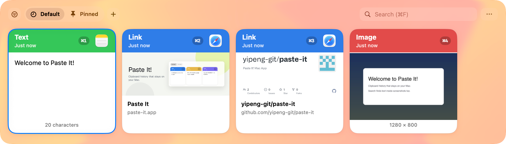

# Paste It

[English](README.md) | [中文](README.zh-CN.md) | [日本語](README.ja.md) | **한국어**

macOS용 로컬 클립보드 매니저 — 시각적 타임라인, 검색 가능한 기록(스크린샷 속 글자 포함), 방해하지 않는 네이티브 사용감.

**웹사이트:** [paste-it.app](https://paste-it.app)



## 기능

- 복사한 내용을 시각적 타임라인으로 보기
- 텍스트 검색 — 스크린샷·이미지 안의 글자도 포함
- 미리보고 수정한 뒤 붙여넣기
- 중요한 항목 고정(폴더로도 정리 가능)
- Paste Stack으로 여러 클립을 순서대로 붙여넣기

## 설치

1. [paste-it.app](https://paste-it.app) 또는 [GitHub Releases](https://github.com/yipeng-git/paste-it/releases/latest)에서 최신판 다운로드.
2. `.dmg`를 열거나 압축을 풀고 **Paste It**을 **응용 프로그램**으로 드래그.
3. 응용 프로그램에서 실행. 메뉴 바에 상주합니다.
4. 다른 앱에 한 키로 붙여넣으려면 안내에 따라 **손쉬운 사용**을 허용(시스템 설정 → 개인정보 보호 및 보안 → 손쉬운 사용).

macOS 14 이상. 공식 빌드는 백그라운드에서 자동 업데이트됩니다.

## 사용법

1. 평소처럼 복사 — Paste It이 로컬에 기록을 남깁니다.
2. **⇧⌘V**(또는 메뉴 바 아이콘)로 타임라인 열기.
3. 입력해 검색하거나 유형으로 필터. **⌘1…9**로 빠르게 고르거나, 카드를 고른 뒤 **Return**으로 붙여넣기.
4. **Space**로 타임라인 위 미리보기. 텍스트를 클릭해 편집. 이미지는 OCR, 링크는 페이지 미리보기.
5. 남길 항목은 고정하거나 커스텀 폴더에 넣기(최대 3개).

### 더 많은 단축키

| 단축키 | 동작 |
|--------|------|
| **⇧⌘V** | 타임라인 열기 / 닫기 |
| **⌘1…9** | 해당 카드를 올리고 패널 닫기 |
| **Return** | 선택 항목 붙여넣기(손쉬운 사용 필요) |
| **⇧Return** | 일반 텍스트로 붙여넣기 |
| **Space** | 미리보기 |
| **⌘E** | 선택한 클립 편집 |
| **⇧⌘C** | Paste Stack 열기 |
| **⌥⌘V** | Stack 다음 항목 붙여넣기 |
| **⌃⌘V** | 현재 클립보드를 한 번만 일반 텍스트로 붙여넣기 |
| **⇧⌘T** | 캡처 일시 중지 / 재개(메뉴에서) |

**Paste Stack:** **⇧⌘C**로 연 뒤 여러 번 복사해 큐에 넣고, **⌥⌘V**(또는 Stack이 열린 상태에서 **⌘V**)로 하나씩 붙여넣기. 순서(오래된 것 / 최신 것 먼저)는 설정 → Stack.

**다중 선택:** **⌘**-클릭으로 여러 장을 고른 뒤 **Return**으로 순서대로 붙여넣기.

클립을 고르면 시스템 클립보드에 올라갑니다(손쉬운 사용 불필요). 자동 붙여넣기(**Return**, Stack, **⌃⌘V**)는 손쉬운 사용이 필요합니다.

## 개인정보

기록은 이 Mac에만 — 계정 없음, 클라우드 동기화 없음. 비밀번호 관리자 등 보호된 pasteboard 유형은 기본적으로 건너뜁니다. 설정에서 캡처 일시 중지, 앱 무시, 보관 기간 제한이 가능합니다.

선택적 익명 통계(공식 빌드에서는 켜짐)에는 클립보드 내용, OCR, 경로, 검색어가 **포함되지 않습니다**. **설정 → 개인정보**에서 언제든 끌 수 있습니다. 자세한 내용: [`docs/analytics.md`](docs/analytics.md).

## 에이전트용(선택)

로컬 [MCP](https://modelcontextprotocol.io) 서버로 에이전트가 기록을 읽고 검색할 수 있습니다. **기본 꺼짐** — 앱 실행 중 메뉴 바에서 **MCP** 켜기(`http://127.0.0.1:17321/mcp`). 설정과 도구: [`docs/mcp.md`](docs/mcp.md).

## 소스에서 빌드

기여자용:

```sh
swift run PasteIt
# 또는
./scripts/run-app.sh
```

Xcode / Swift 6.2 필요. 패키징·서명: [`docs/mac-packaging.md`](docs/mac-packaging.md). 업데이트 구조: [`docs/mac-updates.md`](docs/mac-updates.md).

## 라이선스

[PolyForm Noncommercial License 1.0.0](LICENSE) — 개인·교육·연구·취미 등 비상용은 무료. **상업용은 저작권자와 별도 라이선스가 필요**합니다.

이 라이선스로 바꾸기 전에 MIT로 낸 버전은, 그 릴리스에 한해 계속 MIT로 쓸 수 있습니다.
