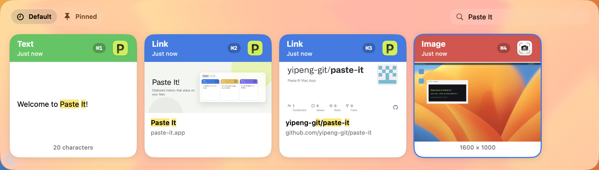

# Paste It

[English](README.md) | [中文](README.zh-CN.md) | [日本語](README.ja.md) | **한국어**

로컬 전용 macOS 클립보드 매니저 — 네이티브 SwiftUI, Liquid Glass, 에이전트용 MCP.

**웹사이트:** [paste-it.app](https://paste-it.app)


- **완전 로컬** — 계정 없음, 클라우드 동기화 없음. 기록은 이 Mac에만 남습니다.
- **네이티브 SwiftUI** — AppKit 플로팅 패널 + SwiftUI 타임라인. **macOS 26+는 Liquid Glass** (이전 버전은 머티리얼로 대체).
- **AI용** — 로컬 **MCP**(선택)로 에이전트가 기록을 읽고 검색(OCR 포함)하며, 임시 타임라인 스크린샷을 만들 수 있습니다.
- **이미지 속 글자도 검색** — Vision OCR이 복사한 이미지·스크린샷을 인덱싱. 텍스트, 리치 텍스트, HTML, 파일, 링크도 됩니다.



스크린샷·이미지 안의 글자도 찾을 수 있습니다 — 일반 텍스트만이 아닙니다.

## 기능

- 플로팅 타임라인(**Shift + Command + V**) — 카드와 미리보기.
- Pinboard: 드래그 앤 드롭으로 고정, 영구 보관 가능.
- Paste Stack(**Shift + Command + C**) — 모으고 순서 바꾼 뒤, 차례로 붙여넣기.
- Quick Copy: **Command + 1…9**, 일반 텍스트로 붙여넣기, 여러 항목 텍스트 복사.
- 개인정보: 캡처 일시 중지, 앱·pasteboard 유형 무시, 보관 기간, 저장소 정리.
- 익명 사용 통계(PostHog, 선택) — 클립보드 내용은 **보내지 않습니다**. [`docs/analytics.md`](docs/analytics.md), [`docs/analytics-dashboard.md`](docs/analytics-dashboard.md). 설정 → 개인정보에서 끄고 켤 수 있습니다.
- Sparkle로 앱 내 업데이트.

클립을 고르면 시스템 클립보드에 올라갑니다(손쉬운 사용 불필요). Paste Stack의 “Paste Next”는 필요 시 **Command + V**를 자동 입력하며, 이때는 손쉬운 사용 권한이 필요합니다.

## 개인정보 및 분석

클립보드 기록은 **이 Mac에만** 있습니다. 공식 빌드에서는 PostHog가 기본으로 켜져 있고, 패널 열기/닫기, 붙여넣기 준비, 온보딩, 업데이트 흐름 같은 익명 이벤트만 보냅니다 — 텍스트, OCR, 경로, 검색어는 **넣지 않습니다**. 이벤트 목록: [`docs/analytics.md`](docs/analytics.md). 대시보드 만드는 법: [`docs/analytics-dashboard.md`](docs/analytics-dashboard.md). **설정 → 개인정보**에서 언제든 끌 수 있습니다.

## 에이전트용 MCP

로컬 [Model Context Protocol](https://modelcontextprotocol.io) 서버(선택) — **기본 꺼짐**. Paste It 실행 중 메뉴 바의 **MCP**에서 켭니다.

- URL: `http://127.0.0.1:17321/mcp` (루프백만, Stateless HTTP)
- 읽기 전용: list, get, search(소스 앱, OCR, 앱과 같은 쿼리)
- 카드 내용으로 임시 타임라인 스크린샷 생성(메인 기록에는 쓰지 않음)

도구, curl 예제, 클라이언트 설정: [`docs/mcp.md`](docs/mcp.md)(영어).

## 요구 사항

- macOS 14+
- Xcode / Swift 6.2 툴체인

## 실행

```sh
swift run PasteIt
```

최소 `.app` 만들기(업데이트 확인용 Sparkle 포함):

```sh
./scripts/run-app.sh
```

이 폴더를 Xcode로 열어 Swift Package로 실행·디버그할 수도 있습니다.

## 업데이트

자동 업데이트는 Sparkle. 피드 URL은 [`Info.plist`](Info.plist)의 `SUFeedURL`(GitHub Pages). [`docs/mac-updates.md`](docs/mac-updates.md). 서명 릴리스는 [`scripts/package-release.sh`](scripts/package-release.sh) — 설정은 [`docs/mac-packaging.md`](docs/mac-packaging.md).

## 라이선스

[PolyForm Noncommercial License 1.0.0](LICENSE) — 개인·교육·연구·취미 등 비상용은 무료. **상업용은 저작권자와 별도 라이선스가 필요**합니다.

이 라이선스로 바꾸기 전에 MIT로 낸 버전은, 그 릴리스에 한해 계속 MIT로 쓸 수 있습니다.
